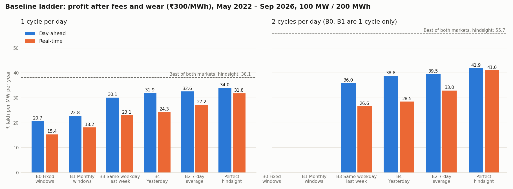

# Baseline results: first analysis

Run on 2026-10-02 with `python bess.py baselines` (spec: [baselines.md](baselines.md)).
- Evaluated: 1 May 2022 – 30 Sep 2026, 1,614 days.
- Battery: 100 MW / 200 MWh, 87% round trip, 10–90% charge band, fees ₹20/MWh each side.
- Figures are ₹ lakh per MW per year, after fees and wear, before transmission charges
  and operating costs.
- Unless stated otherwise, the wear cost is ₹300/MWh.
- All 75 result checks pass.

Full results:
- `reports/baselines/summary.html` and `summary.csv`;
- one folder per run with `report.html` and `daily.csv`;
- the `runs` and `results` tables in `power.db`.

## 1. The ladder

| Baseline | DA, 1 cycle | DA capture | RT, 1 cycle | RT capture | DA, 2 cycles | DA capture | RT, 2 cycles | RT capture |
|---|---|---|---|---|---|---|---|---|
| B0 fixed windows | 20.7 | 61% | 15.4 | 48% | – | | – | |
| B1 monthly windows | 22.8 | 67% | 18.2 | 57% | – | | – | |
| B3 same weekday last week | 30.1 | 89% | 23.1 | 73% | 36.0 | 86% | 26.6 | 65% |
| B4 yesterday | 31.9 | 94% | 24.3 | 76% | 38.8 | 93% | 28.5 | 70% |
| **B2 7-day average** | **32.6** | **96%** | **27.2** | **85%** | **39.5** | **94%** | **33.0** | **80%** |
| Ceiling (perfect hindsight) | 34.0 | 100% | 31.8 | 100% | 41.9 | 100% | 41.0 | 100% |
| Best of both markets, hindsight | 38.1 | | | | 55.7 | | | |

Capture is profit divided by the ceiling in the same market and cycle setting.

**Reference baseline: B2, the 7-day average.** It's the best rung in both markets and at
both cycle settings, so it's the baseline any new strategy must beat. It beats B4 on 56% of
day-ahead days. Averaging a week is more robust than trusting a single day.

## 2. What the results say

1. **Day-ahead prices are very predictable from recent history.** Averaging the last 7 days
   gets 96% of the 1-cycle ceiling. The remaining room for a day-ahead forecast is small:
   - 1.4 lakh/MW/yr at 1 cycle (4%);
   - 2.4 lakh/MW/yr at 2 cycles (6%).

   A forecasting product that only improves day-ahead planning has little to sell.
2. **The fixed-window rule from the design doc is a weak floor.** It captures only 61%. Simply
   planning on last week's average adds 11.9 lakh/MW/yr (+57%). A "smart rule" is cheap, so
   the business case can't rest on beating fixed windows.
3. **Real-time leaves more on the table.**
   - B2 captures 85% at 1 cycle and 80% at 2 cycles. That's 4.6 and 8.0 lakh/MW/yr of room.
   - Real-time prices are less repeatable, so a forecast, or re-planning during the day, has
     more to work with.
4. **A second cycle per day is worth it, even after wear.**
   - Day-ahead: +6.9 lakh/MW/yr at B2 and +7.9 at the ceiling.
   - The battery averages 1.56 cycles/day when allowed 2, so wear makes it skip the weak
     second cycles.
5. **Using both markets is where the big gap is.**
   - The best-of-both hindsight ceiling is 55.7 at 2 cycles, versus 39.5 for the best
     day-ahead baseline. That's a gap of 16.2 lakh/MW/yr.
   - It's an upper bound, not an achievable figure: a real strategy commits in day-ahead
     before seeing real-time.
   - Still, it's three times larger than any single-market gap, so this is where Phase 3
     effort belongs.
6. **Restricting charging to 10:00–15:00 removes the second cycle.**

   | Setting | Day-ahead ceiling, 2 cycles | Day-ahead B2, 2 cycles |
   |---|---|---|
   | Charge any time | 41.9 | 39.5 |
   | Charge 10:00–15:00 only | 32.2 | 31.3 |

   The first cycle barely changes: the 1-cycle ceiling only drops from 34.0 to 32.2. Projects
   under the new connectivity and state rules lose about 20% of revenue: the whole value of
   the second cycle.
7. **Results are stable across regimes, and better since day-ahead coupling.**

   | Period | DA-B2, 1 cycle | Capture | DA ceiling, 1 cycle |
   |---|---|---|---|
   | ₹12k cap (May 2022 – Mar 2023) | 31.9 | 93% | 34.2 |
   | ₹10k cap (Apr 2023 – Dec 2025) | 31.6 | 96% | 32.7 |
   | ₹10k cap + coupling (Jan – Sep 2026) | 37.1 | 97% | 38.3 |

   2026 has been the best period so far. It's only 9 months, so seasonality isn't fully
   averaged out.
8. **Seasonality.** Day-ahead B2 capture is 92–98% in every calendar month, lowest in March.
   Real-time is lowest in March (79%) and May (81%). The worst month for nearly every
   strategy is March 2024, when midday and evening prices converged. B1, the stale monthly
   windows, lost money in April 2024: a sign of how fast the daily shape can shift between
   seasons.
9. **Against the lease benchmark.** The design doc's tolling tariff of ₹2.3–2.9 lakh/MW/month
   works out to 28–35 lakh/MW/yr.
   - A 1-cycle day-ahead battery on the 7-day-average rule (32.6) sits inside that range.
   - At 2 cycles (39.5) it's above the range.
   - All before transmission charges and operating costs.

## 3. How much to trust these numbers

- **The battery is assumed not to move prices.** The participation cap (10% of cleared
  volume) cut only 50–600 MWh over 4.4 years. That's negligible, so a 100 MW battery is too
  small to hit it often. Larger batteries need a price-impact model.
- **Missed trades are small.**
  - Real-time no-trade blocks left 40–190 MWh unfilled over the period.
  - Energy left in the battery at day end totals under 250 MWh per run.
- **The optimiser is close to exact.** Its proven gap is at most 0.2% of profit, and every
  check allows for it.
- **Not modelled yet:**
  - transmission charges for standalone batteries;
  - deviation (DSM) penalties;
  - capacity fade over the years;
  - ancillary-service income;
  - market depth for batteries over a few hundred MW.

## 4. What this means for the next steps

1. **Day-ahead forecasting (Phase 2b).** Only 4–6% of the day-ahead ceiling is left. Test one
   forecast to confirm, but don't over-invest.
2. **Two-stage day-ahead + real-time strategies (Phase 3) are the priority.**
   - The target is the 16 lakh/MW/yr gap between B2 at 2 cycles (39.5) and the best-of-both
     ceiling (55.7).
   - The first test: commit B2's day-ahead plan, then re-plan before each real-time session.
3. **Real-time re-planning during the day.** The reference to beat is RT-B2, at 27.2 (1 cycle)
   and 33.0 (2 cycles).
4. **Charging restrictions.** Report every strategy under the 10:00–15:00 charging rule as well.
   For affected projects, the second cycle and any midnight-to-morning trades disappear.
